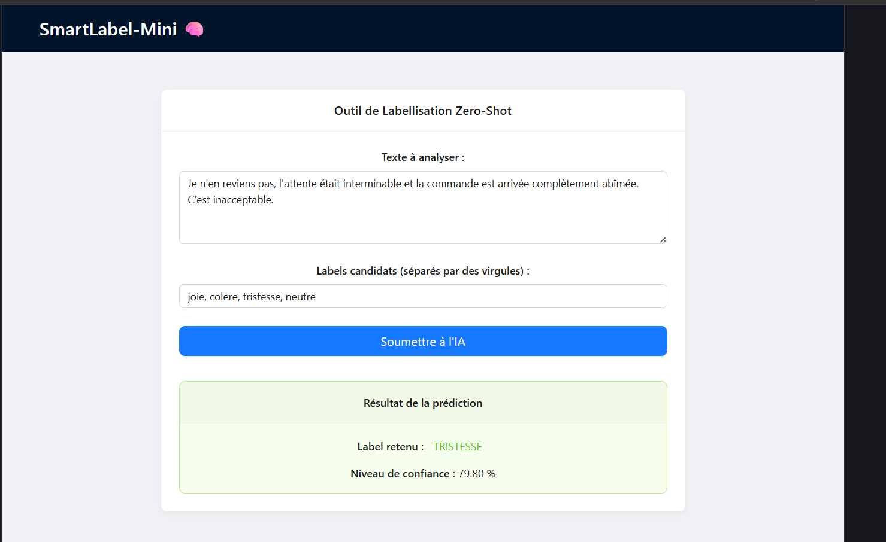

# 🧠 SmartLabel-Mini : Classification Zéro-Shot Multilingue



## 🎯 Utilité du projet
SmartLabel-Mini est une application Fullstack conçue pour la classification dynamique de textes à l'aide de l'Intelligence Artificielle (NLP). 

Contrairement aux modèles traditionnels qui nécessitent un long entraînement spécifique pour chaque nouvelle catégorie, cet outil utilise une approche **Zero-Shot**. Il permet de catégoriser n'importe quel texte selon des labels définis "à la volée" par l'utilisateur. 

Cette flexibilité rend l'application immédiatement opérationnelle pour des cas d'usage variés tels que :
*   L'analyse de sentiments en temps réel.
*   Le routage et la catégorisation automatique de tickets de support client.
*   Le tri thématique de documents ou de flux de données.

## 🏗️ Architecture Technique
L'application repose sur une architecture micro-services, séparant les responsabilités et entièrement conteneurisée :
*   **Frontend :** React.js (Vite) pour une interface utilisateur réactive.
*   **Backend :** FastAPI (Python) assurant un traitement asynchrone et performant des requêtes.
*   **Intelligence Artificielle :** Modèle `xlm-roberta-large-xnli` via la bibliothèque Transformers (Hugging Face), capable de traiter nativement de multiples langues (dont le français et l'anglais).
*   **DevOps :** Docker & Docker Compose pour garantir un environnement d'exécution standardisé, reproductible et un déploiement simplifié.

## 🚀 Lancement du projet (De A à Z)

Voici la procédure complète pour récupérer, construire et lancer ce projet sur votre propre machine. Assurez-vous d'avoir [Docker Desktop](https://www.docker.com/products/docker-desktop/) installé et démarré.

### 1. Cloner le projet
Ouvrez votre terminal, téléchargez le code source depuis GitHub et placez-vous dans le dossier du projet :
```bash
git clone [https://github.com/VOTRE_NOM_D_UTILISATEUR/smartlabel-mini.git](https://github.com/VOTRE_NOM_D_UTILISATEUR/smartlabel-mini.git)
cd smartlabel-mini
```

### 2. Démarrer l'application avec Docker
Lancez la construction et le démarrage des conteneurs en mode détaché (en arrière-plan) avec la commande suivante :
```bash
docker compose up -d --build
```
*(Note : Le tout premier lancement prendra quelques minutes afin de télécharger les environnements de base et de charger le modèle d'IA dans le cache).*

### 3. Accéder à l'interface
Une fois le démarrage terminé, ouvrez votre navigateur web et rendez-vous à l'adresse locale suivante :
👉 **http://localhost:5175/**

### 4. Commandes de gestion utiles
Si vous souhaitez interagir avec les conteneurs en cours d'exécution, voici les commandes essentielles :

*   **Surveiller les journaux (logs) en temps réel :** 
```bash
docker compose logs -f
```

*   **Arrêter l'application proprement :** 
```bash
docker compose down
```

*   **Arrêter l'application et vider le cache du modèle IA :** 
```bash
docker compose down -v
```

---
*Projet développé par Ramcy Said FOM.*