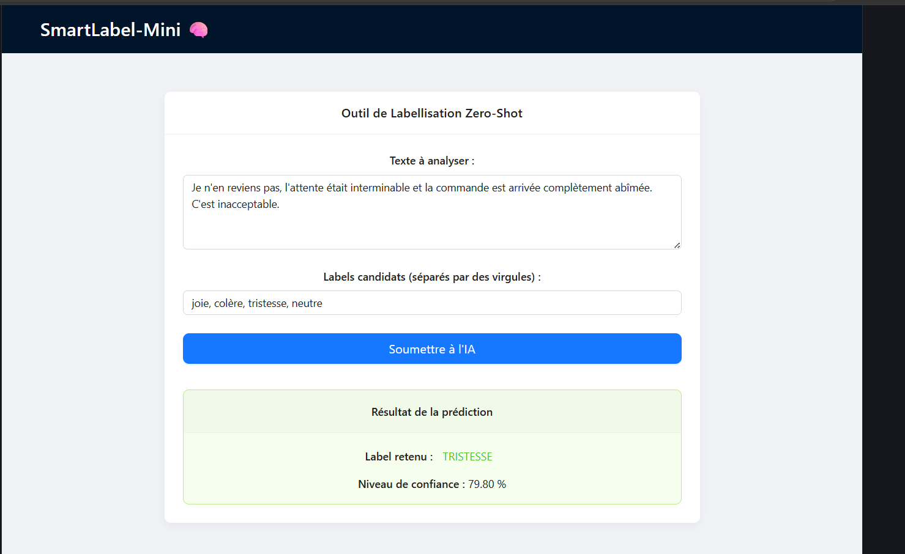

# SmartLabel-Mini — trier automatiquement un texte dans les catégories de votre choix

Ce projet sert à **ranger un texte dans une catégorie que vous choisissez vous-même** (par exemple « joie », « colère », « tristesse », « neutre »), grâce à une intelligence artificielle, sans avoir à lui apprendre ces catégories au préalable.



---

## À quoi ça sert

Trier des textes à la main prend du temps : lire chaque message client, chaque avis ou chaque document, puis décider dans quelle « case » il va.

SmartLabel-Mini fait ce tri à votre place. Vous lui donnez :

1. un **texte**, par exemple : « Je n'en reviens pas, l'attente était interminable et la commande est arrivée complètement abîmée. C'est inacceptable. » ;
2. une **liste de catégories** possibles, séparées par des virgules, par exemple : `joie, colère, tristesse, neutre`.

L'application répond avec **la catégorie la plus probable** et un **niveau de confiance** (un pourcentage qui indique à quel point l'IA est sûre de son choix).

Le point fort : **vous pouvez changer les catégories à tout moment**. Aujourd'hui des émotions, demain `livraison, facturation, panne technique` pour trier des demandes au service client. Il n'y a rien à reprogrammer.

Exemples d'usages possibles :

- repérer l'émotion ou l'humeur d'un message (satisfait, en colère, neutre…) ;
- orienter automatiquement des demandes de support client vers le bon service ;
- classer des documents ou des messages par thème.

---

## Comment ça marche

### L'idée : la classification « zero-shot »

D'habitude, pour qu'une IA range des textes dans des catégories, il faut d'abord l'**entraîner** : lui montrer des milliers d'exemples déjà triés pour chaque catégorie. Si on ajoute une catégorie, il faut recommencer.

La méthode utilisée ici s'appelle **zero-shot** (« zéro exemple ») : l'IA n'a besoin d'**aucun exemple** pour vos catégories. Elle a déjà appris, de façon générale, à juger si une phrase « va avec » une autre. Pour chaque catégorie proposée, elle se demande en quelque sorte : « Ce texte parle-t-il de *colère* ? de *joie* ? … », puis garde la catégorie qui convient le mieux.

C'est comme demander à quelqu'un qui maîtrise bien la langue de ranger des lettres dans des boîtes étiquetées : il n'a pas besoin de formation spéciale, il lit l'étiquette et le contenu, et décide.

### Les étapes

1. Vous saisissez le texte et les catégories dans la page web.
2. La page envoie ces informations au **serveur** (le programme qui tourne en arrière-plan).
3. Le serveur les transmet à un **modèle d'IA** : un programme qui a « appris » à comprendre le langage en lisant une très grande quantité de textes. Celui utilisé ici, `joeddav/xlm-roberta-large-xnli`, est **multilingue** : il comprend notamment le français et l'anglais.
4. Le modèle attribue un score à chaque catégorie. Le serveur renvoie la meilleure catégorie et son score.
5. La page affiche le résultat.

Le modèle tourne **sur votre propre machine**. Il est téléchargé une fois depuis **Hugging Face** (une plateforme qui partage des modèles d'IA) au premier lancement, puis gardé en mémoire pour les fois suivantes. Le texte analysé n'est envoyé à aucun service extérieur.

---

## Comment on s'en sert : le tri des tickets de support

L'application est pensée pour une équipe de support client qui reçoit des tickets (emails, formulaires, messages) à répartir. On y accède après une **connexion par email et mot de passe** (voir « Authentification » plus bas). Le travail se fait en trois étapes :

1. **Choisir les catégories de tri.** Un jeu est proposé (« Support client » : facturation, livraison, panne technique, compte et accès, réclamation, autre, avec les priorités urgente / normale / basse). On peut le modifier, créer ses propres jeux et les **enregistrer pour toute l'équipe**.
2. **Charger les tickets.** Soit en important un **fichier CSV** (la colonne du texte est repérée par son nom : `texte`, `message`, `description`… ; une colonne `id` est facultative), soit en collant les tickets, un par ligne. Maximum 500 tickets à la fois.
3. **Valider les résultats.** Pour chaque ticket, l'IA **propose** une catégorie et une priorité avec un niveau de confiance. Sous le **seuil de confiance** (75 % par défaut, réglable), le ticket est marqué **« à relire »**. La personne qui trie peut corriger la catégorie ou la priorité, valider ligne par ligne ou d'un clic tous les cas sûrs, puis **exporter le résultat en CSV** (avec la proposition de l'IA, la décision finale et le statut).

Principe : **l'IA propose, l'humain décide.** Le pourcentage de confiance sert à concentrer l'attention humaine sur les cas douteux.

> La capture d'écran en haut de cette page montre l'ancienne version de l'interface (analyse d'un seul texte).

---

## Pour les développeurs

### Architecture

L'application est composée de deux services, conteneurisés avec Docker :

- **Frontend** : React 19 + Vite, avec la bibliothèque de composants Ant Design. L'API est appelée via `axios`.
- **Backend** : FastAPI (Python), servi par Uvicorn.
- **Modèle d'IA** : `joeddav/xlm-roberta-large-xnli`, chargé avec le `pipeline("zero-shot-classification")` de la bibliothèque Transformers (Hugging Face) et exécuté avec PyTorch. Le modèle est chargé une seule fois au démarrage du backend.
- **Docker / Docker Compose** : un environnement d'exécution identique sur toutes les machines. Un volume Docker (`huggingface_cache`) conserve le modèle téléchargé entre deux démarrages.

### API

| Méthode | Route | Rôle |
|---|---|---|
| `POST` | `/api/login` | Vérifie l'email et le mot de passe, renvoie un jeton de session (seule route publique) |
| `POST` | `/api/predict` | Classe un texte parmi les catégories fournies |
| `POST` | `/api/triage` | Propose une catégorie (et une priorité, facultative) pour jusqu'à 50 tickets |
| `GET` | `/api/label-sets` | Liste les jeux de catégories enregistrés |
| `PUT` | `/api/label-sets/{nom}` | Crée ou remplace un jeu de catégories (50 jeux maximum) |
| `DELETE` | `/api/label-sets/{nom}` | Supprime un jeu |

Exemple de requête :

```json
{
  "text": "Le client est vraiment furieux à cause du retard de livraison.",
  "candidate_labels": ["joie", "colère", "tristesse", "neutre"]
}
```

Format de la réponse :

```json
{
  "text": "…",
  "predicted_label": "…",
  "confidence_score": 0.0
}
```

`confidence_score` est le score de la catégorie retenue, entre 0 et 1, arrondi à 4 décimales. La documentation interactive de l'API (générée par FastAPI) est disponible sur **http://localhost:8000/docs**.

### Lancement avec Docker (recommandé)

Prérequis : [Docker Desktop](https://www.docker.com/products/docker-desktop/) installé et démarré.

#### 1. Cloner le projet

```bash
git clone https://github.com/Ramcy-cloud/smartlabel-mini.git
cd smartlabel-mini
```

#### 2. Construire et démarrer les conteneurs

En arrière-plan (mode « détaché ») :

```bash
docker compose up -d --build
```

Le premier lancement prend plusieurs minutes : Docker télécharge les images de base et les dépendances, puis le backend télécharge le modèle d'IA.

#### 3. Ouvrir l'interface

- Interface : **http://localhost:5175/** (le port 5175 de la machine est relié au port 5173 du conteneur)
- API : **http://localhost:8000**

Le frontend appelle l'API à l'adresse `http://127.0.0.1:8000/api` (définie dans `frontend/src/services/api.js`).

#### 4. Commandes utiles

- Suivre les journaux (logs) en temps réel :

  ```bash
  docker compose logs -f
  ```

- Arrêter l'application :

  ```bash
  docker compose down
  ```

- Arrêter l'application et supprimer le cache du modèle d'IA (il sera retéléchargé au prochain lancement) :

  ```bash
  docker compose down -v
  ```

### Lancement sans Docker

Backend (Python 3.10 ou plus récent ; l'image Docker utilise Python 3.10) :

```bash
cd backend
pip install -r requirements.txt
uvicorn app.main:app --host 0.0.0.0 --port 8000
```

Frontend (Node.js et npm) :

```bash
cd frontend
npm install
npm run dev
```

L'interface est alors disponible sur **http://localhost:5173**.

### Authentification

L'application est protégée par un compte partagé par l'équipe (même principe que le projet RAG PDF).

1. Définissez `APP_EMAIL` et `APP_PASSWORD` : dans un fichier `.env` à la racine pour Docker, ou dans `backend/.env` sans Docker (modèle dans `.env.example`). **Si l'une des deux est vide, personne ne peut se connecter.** Choisissez un mot de passe long et unique ; ne le mettez jamais dans le code ni dans un fichier suivi par Git.
2. `POST /api/login` vérifie les identifiants (comparaison à temps constant, adresse email insensible à la casse) et renvoie un jeton de session. Après 5 échecs depuis une même adresse IP, les connexions sont refusées pendant une minute.
3. Toutes les autres routes `/api` exigent l'en-tête `Authorization: Bearer <jeton>` (`401` sinon). Le jeton change à chaque redémarrage du backend : il faut alors se reconnecter. Le navigateur le garde le temps de l'onglet (`sessionStorage`).

Limites : un seul compte partagé, pas de rôles ni de journal des actions, et le jeton est unique pour tous les utilisateurs (la déconnexion l'efface du navigateur mais ne l'invalide pas côté serveur). Servez toujours l'application en **HTTPS** hors de votre machine : sans cela, mot de passe et jeton circulent en clair.

### Sécurité de l'API

- **Limites :** requête de 1 Mo maximum (`413` au-delà), 50 tickets de 5 000 caractères par requête, 20 libellés de 100 caractères par jeu. Les routes d'IA sont limitées par adresse IP (`RATE_LIMIT_PER_MINUTE`, 60 par défaut, `429` au-delà). Une seule prédiction est calculée à la fois : les autres requêtes patientent.
- **Hôtes acceptés :** `ALLOWED_HOSTS` (noms séparés par des virgules ; par défaut `localhost,127.0.0.1`). À renseigner avec le nom de domaine réel en déploiement.
- **En-têtes :** `X-Content-Type-Options`, `X-Frame-Options`, `Referrer-Policy`, `Cache-Control: no-store` sur l'API. Ajoutez `Strict-Transport-Security` et le HTTPS sur le serveur frontal (proxy) en production.
- **Données :** les textes des tickets ne sont ni enregistrés ni écrits dans les journaux. Seuls les jeux de catégories sont conservés, dans `backend/data/label_sets.json` (variable `LABEL_SETS_PATH`, volume Docker `label_sets_data`). Un fichier corrompu est mis de côté en `.corrompu` au lieu d'être écrasé.
- **Export CSV :** les cellules qui commencent par `=`, `+`, `-` ou `@` sont neutralisées pour éviter l'exécution de formules dans Excel (« CSV injection »).
- **Un seul processus :** le verrou des jeux enregistrés et la limitation de débit sont en mémoire ; lancez Uvicorn avec un seul worker.

### Configuration : origines autorisées (CORS)

Par sécurité, le navigateur n'autorise une page web à interroger l'API que si l'adresse de cette page figure dans la liste des **origines autorisées**. Cette liste se règle avec la variable d'environnement `ALLOWED_ORIGINS` : des adresses séparées par des virgules, les espaces sont ignorés.

- **Valeur par défaut** (variable absente) : `http://localhost:5175,http://localhost:5173`, c'est-à-dire l'interface lancée avec Docker et celle lancée avec `npm run dev`. Le fonctionnement local ne change donc pas.
- **Exemple pour un déploiement** : `ALLOWED_ORIGINS=https://app.example.com,https://admin.example.com`
- `*` (« tout le monde ») est **refusé** : le backend ne démarre pas si cette valeur est présente.
- Avec Docker, `docker-compose.yml` transmet la variable au backend ; vous pouvez la définir dans un fichier `.env` placé à la racine (voir `.env.example`). Sans Docker, définissez-la avant `uvicorn`, par exemple `ALLOWED_ORIGINS=https://app.example.com uvicorn app.main:app` (Linux/macOS).
- Seules les méthodes `GET`, `POST`, `PUT`, `DELETE` et les en-têtes `Content-Type` et `Authorization` sont autorisés. Il n'y a pas de cookies, donc pas de credentials CORS.

### Tests du backend

```bash
cd backend
pip install -r requirements-dev.txt
python -m pytest
```

Les tests vérifient la configuration CORS. Le vrai modèle d'IA n'est pas chargé : il est remplacé par un faux.

### CI/CD

Les workflows s'appuient sur les modèles partagés de [`Ramcy-cloud/ci-templates`](https://github.com/Ramcy-cloud/ci-templates) (version `v1`).

- **CI** (`.github/workflows/ci.yml`) — à chaque pull request et à chaque push sur `main` : tests du backend (`pytest`, sans charger le vrai modèle), lint et build du frontend, construction des images Docker sans publication.
- **CD** (`.github/workflows/cd.yml`) — quand la CI est verte sur `main`, une livraison démarre puis **attend une validation manuelle** (environnement GitHub `production`). Pour livrer : onglet *Actions* → exécution *CD* → **Review deployments** → cocher `production` → **Approve and deploy**. Les images sont alors publiées sur `ghcr.io/ramcy-cloud/smartlabel-mini/backend` et `.../frontend` (tags `latest` et SHA du commit).
- Aucun secret n'est nécessaire : le token `GITHUB_TOKEN` fourni par GitHub Actions suffit pour publier sur ghcr.io.

### Structure du projet

```
smartlabel-mini/
├── backend/
│   ├── Dockerfile
│   ├── requirements.txt
│   ├── requirements-dev.txt      # Dépendances de test (pytest)
│   ├── tests/                    # Tests (CORS, triage, sécurité)
│   └── app/
│       ├── main.py               # Application FastAPI, CORS (ALLOWED_ORIGINS), préfixe /api
│       ├── auth.py               # Connexion, jeton de session, anti brute-force
│       ├── security.py           # Limites de taille et de débit, en-têtes, hôtes
│       ├── api/routes.py         # Routes /predict, /triage, /label-sets
│       ├── models/schemas.py     # Formats de requête et de réponse (Pydantic)
│       └── services/
│           ├── ai_service.py     # Chargement du modèle et prédiction
│           └── label_sets.py     # Jeux de catégories enregistrés
├── frontend/
│   ├── Dockerfile
│   ├── package.json
│   ├── index.html
│   ├── vite.config.js
│   ├── public/                   # Icônes
│   └── src/
│       ├── App.jsx               # Page principale (catégories, tickets, résultats)
│       ├── components/           # Connexion, choix des catégories, saisie des tickets, tableau de résultats
│       ├── csv.js                # Lecture et export CSV
│       ├── triage.js             # Règles de statut (à relire, corrigé…)
│       ├── services/api.js       # Appel à l'API
│       └── *.css                 # Styles
├── docker-compose.yml
├── .env.example                  # Variables d'environnement (ALLOWED_ORIGINS)
├── image_99b8db.png              # Capture d'écran
└── README.md
```

### Limites connues

- Authentification minimale : un seul compte partagé, un jeton commun, pas de rôles (voir « Authentification »). Pour un usage multi-utilisateurs, prévoyez des comptes individuels, ou un fournisseur d'identité de l'entreprise (SSO).
- Pas de traitement en arrière-plan : l'analyse se fait par lots de 10 tickets, page ouverte (environ une à deux secondes par ticket sur processeur). Fermer la page interrompt l'analyse.
- Les jeux de catégories sont partagés par toutes les personnes connectées (pas de droits par utilisateur).
- La qualité dépend du modèle zero-shot : sur des catégories proches, elle est moindre qu'un modèle entraîné sur vos propres tickets. Mesurez la précision sur un échantillon de vos tickets avant tout usage réel.
- Le frontend Docker tourne avec le serveur de développement de Vite (`npm run dev`), pas avec une version compilée pour la production.

---

*Projet développé par Ramcy-cloud.*
